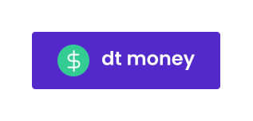
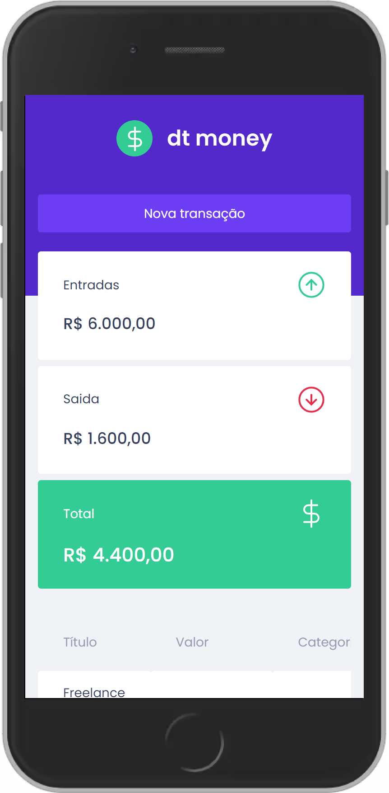

<h1 align="center">
  </img>
</h1>

<p align="center">
  <a href="#-descrição">Descrição</a> •
  <a href="#-tecnologias">Tecnologias</a> •
  <a href="#-pré-requisitos">Pré-requisitos</a> •
  <a href="#-como-usar">Como usar</a> •
  <a href="#-espiadinha">Espiadinha</a>
</p>

<p align="center">
  </img>
</p>

## ℹ Descrição

Projeto desenvolvido no capítulo 2 da trilha ReactJS do Ignite. 👨‍🚀🚀

**dt money** é um app de finanças pessoais. Funciona buscando dados do servidor _(MirageJS)_ e exibindo um sumário das entradas, saídas e o total disponível na conta, além de mostrar o histórico de todas as transações feitas.

A principal funcionalidade da aplicação é cadastrar uma nova transação, de entrada ou saída, atribuindo o título, preço e a categoria que pertence. <br />
Por exemplo: Uma nova transação de saída no valor de R$500,00 chamada "Conta de luz" de categoria “Casa”.

## ⚒ Tecnologias

- [React](https://pt-br.reactjs.org/)
- [ContextAPI](https://pt-br.reactjs.org/docs/context.html)
- [Typescript](https://www.typescriptlang.org/)
- [styled-components](https://styled-components.com/)
- [polished](https://polished.js.org/)
- [react-modal](https://github.com/reactjs/react-modal)
- [Axios](https://axios-http.com/)
- [MirageJS](https://miragejs.com/)

## ⚙ Pré-requisitos

- [Git](https://git-scm.com)
- [Yarn](https://yarnpkg.com)
- Editor de código.

## 🖥 Como usar

**Clone o projeto e acesse a pasta**

```bash
$ git clone https://github.com/EduardoReisUX/dt-money.git && cd dt-money
```

**Siga os passos seguintes**

```bash
# Instale as dependências
$ yarn

# Rode a aplicação
$ yarn start
```

---

Feito com 💜 por [Eduardo dos Reis](https://github.com/EduardoReisUX)
